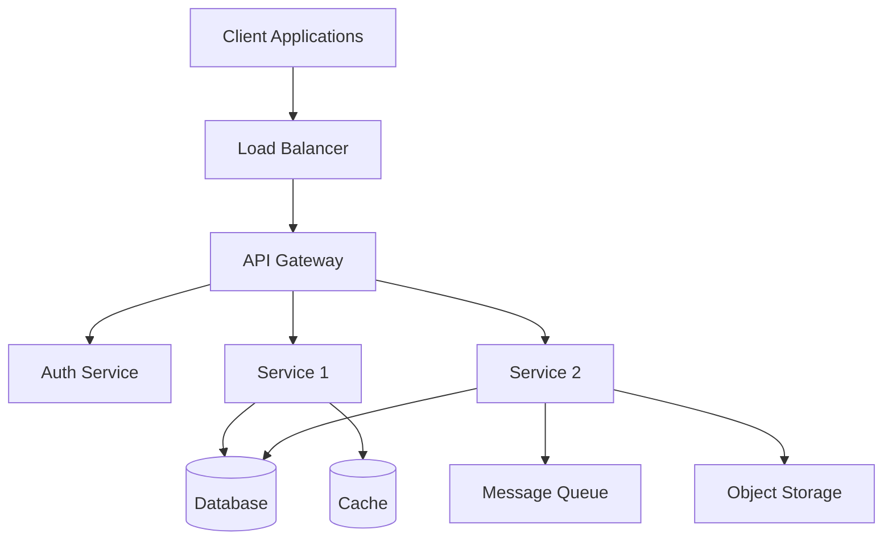
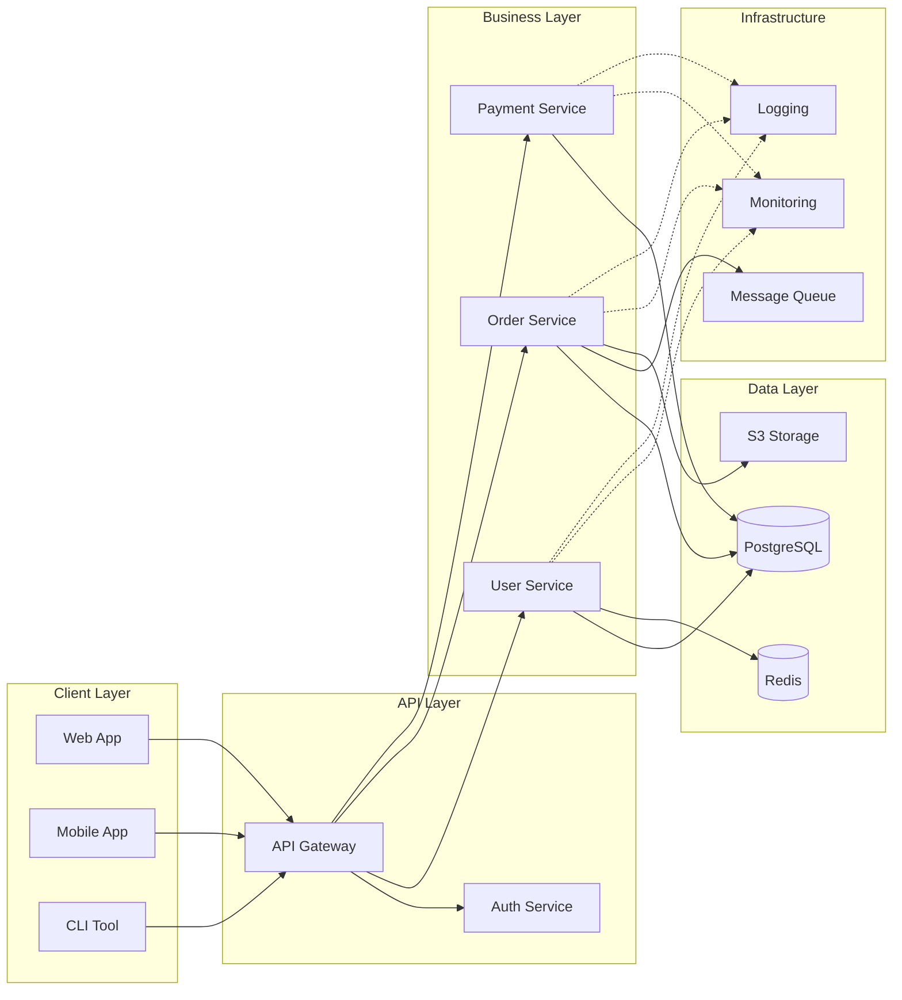
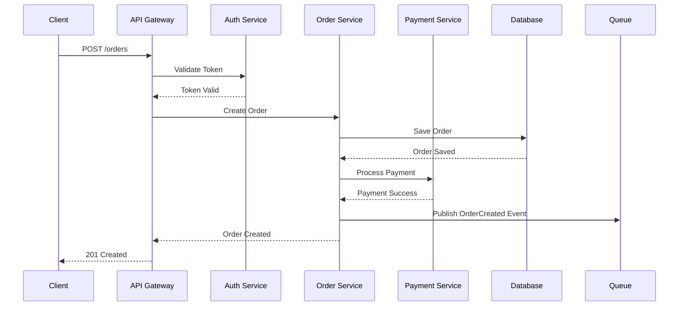
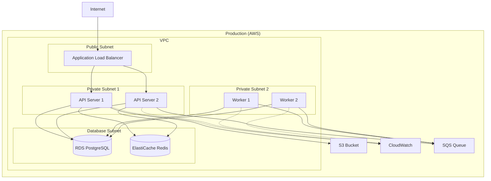

# System Architecture Diagram

**Project**: [Project Name]
**System**: [System Name]
**Version**: [Version]
**Last Updated**: [Date]
**Architect**: [Architect Name]

---

## High-Level Architecture



---

## Layer Breakdown (Clean Architecture)

```
┌─────────────────────────────────────────┐
│     External (UI, Database, APIs)       │
│  ┌───────────────────────────────────┐  │
│  │    Interface Adapters             │  │
│  │  (Controllers, Repositories)      │  │
│  │  ┌─────────────────────────────┐  │  │
│  │  │  Use Cases                  │  │  │
│  │  │  (Business Workflows)       │  │  │
│  │  │  ┌───────────────────────┐  │  │  │
│  │  │  │  Entities             │  │  │  │
│  │  │  │  (Core Domain)        │  │  │  │
│  │  │  └───────────────────────┘  │  │  │
│  │  └─────────────────────────────┘  │  │
│  └───────────────────────────────────┘  │
└─────────────────────────────────────────┘

Dependencies: Outside → Inside
```

---

## Component Diagram



---

## Data Flow Diagram

### Example: Order Creation Flow



---

## Deployment Architecture



---

## Technology Stack

### Frontend
- **Framework**: [e.g., React 18 with TypeScript]
- **State Management**: [e.g., Redux Toolkit]
- **UI Library**: [e.g., Material-UI]
- **Build Tool**: [e.g., Vite]

### Backend
- **Language**: [e.g., Node.js 20 / Python 3.11]
- **Framework**: [e.g., Express.js / FastAPI]
- **API Style**: [e.g., REST / GraphQL]
- **Validation**: [e.g., Zod / Pydantic]

### Database
- **Primary**: [e.g., PostgreSQL 15]
- **Cache**: [e.g., Redis 7]
- **Search**: [e.g., Elasticsearch] (if applicable)
- **Object Storage**: [e.g., AWS S3]

### Infrastructure
- **Cloud Provider**: [e.g., AWS / GCP / Azure]
- **Container**: [e.g., Docker]
- **Orchestration**: [e.g., Kubernetes / ECS]
- **CI/CD**: [e.g., GitHub Actions]
- **Monitoring**: [e.g., DataDog / Prometheus + Grafana]

---

## Folder Structure

```
project-root/
├── frontend/
│   ├── src/
│   │   ├── components/
│   │   ├── pages/
│   │   ├── services/
│   │   └── store/
│   └── package.json
│
├── backend/
│   ├── src/
│   │   ├── domain/          # Entities, value objects
│   │   ├── application/     # Use cases
│   │   ├── infrastructure/  # Database, external services
│   │   └── presentation/    # Controllers, routes
│   └── package.json
│
├── infrastructure/
│   ├── terraform/           # Infrastructure as code
│   ├── kubernetes/          # K8s manifests
│   └── docker/              # Dockerfiles
│
└── docs/
    ├── architecture/
    ├── api/
    └── deployment/
```

---

## Security Architecture

```
┌─────────────────────────────────────┐
│         Security Layers             │
├─────────────────────────────────────┤
│ 1. Network: VPC, Security Groups    │
│ 2. Transport: HTTPS/TLS 1.3         │
│ 3. Auth: JWT + OAuth 2.0            │
│ 4. Authorization: RBAC              │
│ 5. Data: Encryption at rest/transit │
│ 6. Application: Input validation    │
│ 7. Monitoring: WAF, IDS/IPS         │
└─────────────────────────────────────┘
```

**Security Measures**:
- [ ] HTTPS enforced
- [ ] JWT token authentication
- [ ] Role-based access control (RBAC)
- [ ] Input validation & sanitization
- [ ] SQL injection prevention
- [ ] XSS prevention
- [ ] CSRF protection
- [ ] Rate limiting
- [ ] Secrets management (AWS Secrets Manager / Vault)
- [ ] Database encryption at rest
- [ ] Audit logging

---

## Scalability Strategy

### Horizontal Scaling
- **API Servers**: Auto-scaling based on CPU/memory
- **Workers**: Scale based on queue length
- **Database**: Read replicas for read-heavy workloads

### Caching Strategy
```
Client → CDN → API Gateway → Redis Cache → Database
         ↓        ↓              ↓            ↓
       Static   API Routes    Hot Data    Source of Truth
```

**Cache Levels**:
1. **CDN**: Static assets (images, CSS, JS)
2. **Application**: Frequently accessed data (user sessions, config)
3. **Database**: Query result cache

### Load Balancing
- **Algorithm**: Round-robin with health checks
- **Session Affinity**: Sticky sessions (if needed)
- **Health Checks**: HTTP /health endpoint every 30s

---

## Monitoring & Observability

### Metrics to Track
- **Application**: Response time, error rate, throughput
- **Infrastructure**: CPU, memory, disk, network
- **Business**: Orders/sec, revenue, user signups

### Logging Strategy
```
Application → Structured Logs → Log Aggregator → Dashboards
              (JSON format)      (CloudWatch)     (Grafana)
```

### Alerting
- **Critical**: P0 - Page immediately (5xx errors, service down)
- **Warning**: P1 - Notify team (high latency, increased errors)
- **Info**: P2 - Log only (threshold warnings)

---

## Disaster Recovery

### Backup Strategy
- **Database**: Daily backups + point-in-time recovery (PITR)
- **Object Storage**: Versioning enabled
- **Retention**: 30 days for all backups

### Recovery Objectives
- **RTO** (Recovery Time Objective): < 1 hour
- **RPO** (Recovery Point Objective): < 15 minutes

### High Availability
- **Multi-AZ Deployment**: Services across 3 availability zones
- **Database Replication**: Primary + read replicas
- **Failover**: Automatic failover for database

---

## API Design

### REST Endpoints

| Method | Endpoint | Description | Auth Required |
|--------|----------|-------------|---------------|
| GET | /api/v1/users | List users | ✅ Admin |
| GET | /api/v1/users/:id | Get user | ✅ User |
| POST | /api/v1/users | Create user | ❌ Public |
| PATCH | /api/v1/users/:id | Update user | ✅ User |
| DELETE | /api/v1/users/:id | Delete user | ✅ Admin |

### Response Format
```json
{
  "success": true,
  "data": { ... },
  "meta": {
    "page": 1,
    "limit": 20,
    "total": 100
  }
}
```

---

## Performance Requirements

| Metric | Target | Current |
|--------|--------|---------|
| **API Response Time (p95)** | < 200ms | [TBD] |
| **API Response Time (p99)** | < 500ms | [TBD] |
| **Throughput** | > 1000 req/s | [TBD] |
| **Database Query Time** | < 50ms | [TBD] |
| **Uptime** | 99.9% | [TBD] |
| **Error Rate** | < 0.1% | [TBD] |

---

## Architectural Decisions

### ADR-001: Use PostgreSQL for Primary Database
- **Date**: [Date]
- **Status**: Accepted
- **Context**: Need reliable ACID-compliant database
- **Decision**: Use PostgreSQL 15
- **Consequences**:
  - ✅ Strong consistency, mature ecosystem
  - ❌ More complex scaling than NoSQL

### ADR-002: Implement Clean Architecture
- **Date**: [Date]
- **Status**: Accepted
- **Context**: Long-term maintainability required
- **Decision**: Use Clean Architecture with DDD
- **Consequences**:
  - ✅ Testable, framework-independent
  - ❌ More initial complexity

---

**Approved By**: [Name]
**Review Date**: [Date]
**Next Review**: [Date + 3 months]
